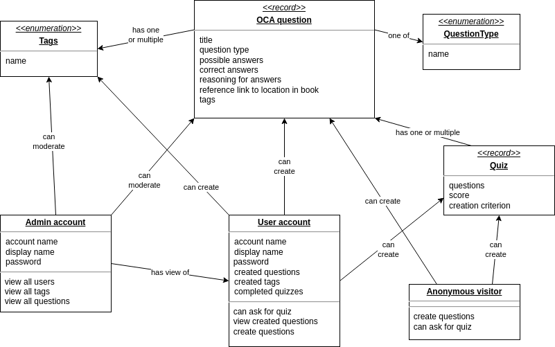
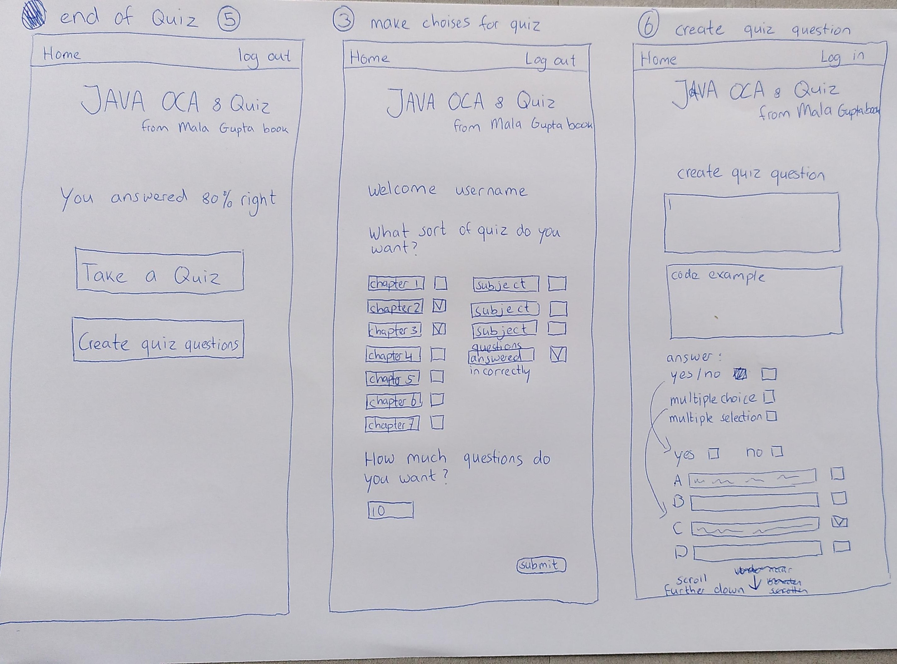
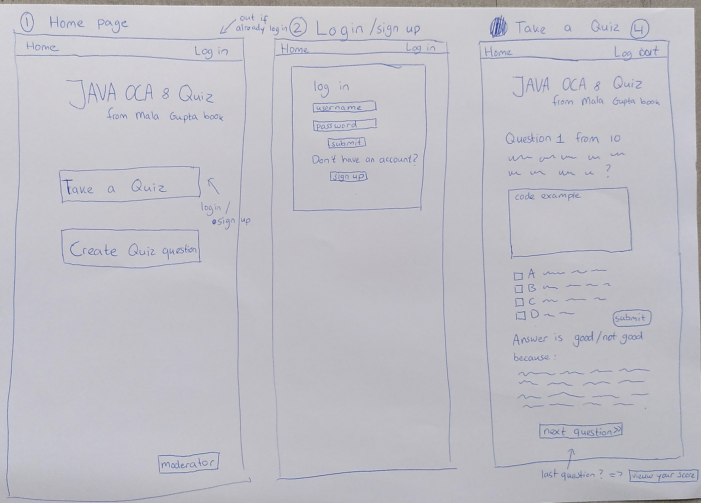
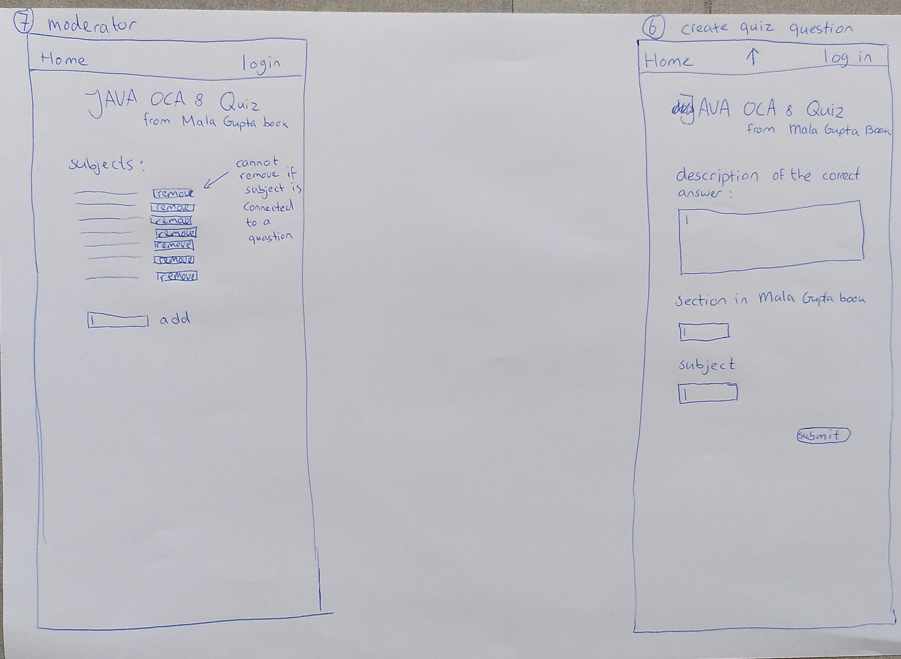

# OCA Java 8 SE Exam Questions Quiz App

## Domain model sketch

## Use case sketch

## Wireframes for UI

### Homepage, login, Take a Quiz.

### End of quiz, make Choises for quiz, create quiz question (part 1).

### Moderator, create quiz question (part 2).

## Personas

- Wants to learn towards a programming test/exam.
- Maybe already works as programmer and is willing to expand their knowledge and/or expertise.
- Studies for a job as programmer.
- Is adult(few below 16 will likely use the app).

## Chosen technologies

- code editor : intelij, vscode
- database : postgresql
- framework for backend : spring boot
- framework for front-end : react + vite
- plugin for styles : tailwind css [see ADR](adr_tailwind_v1.md)

## Ubiquitous language definition
