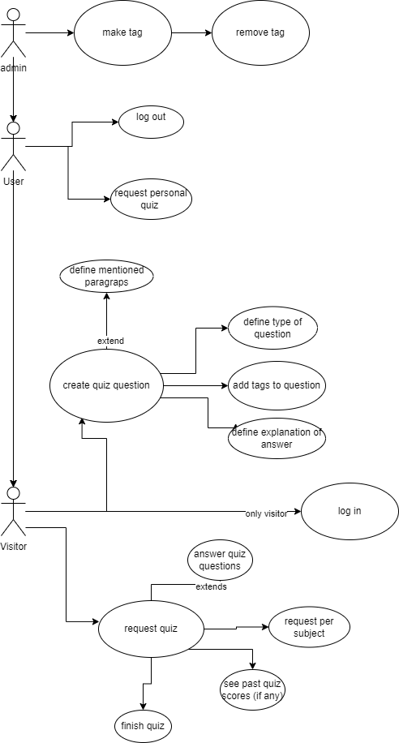

# OCA Java 8 SE Exam Questions Quiz App

## Domain model sketch

## Use case sketch

## Wireframes for UI

### Homepage, login, Take a Quiz.

### End of quiz, make Choises for quiz, create quiz question (part 1).

### Moderator, create quiz question (part 2).

## Personas

- Wants to learn towards a programming test/exam.
- Maybe already works as programmer and is willing to expand their knowledge and/or expertise.
- Studies for a job as programmer.
- Is adult(few below 16 will likely use the app).

## Chosen technologies

- code editor : intelij, vscode
- database : postgresql
- framework for backend : spring boot
- framework for front-end : react + vite [see ADR](adr_vite_v1.md)
- plugin for styles : tailwind css [see ADR](adr_tailwind_v1.md)

## Ubiquitous language definition

|         Word/phrase         | Definition                                                                                                                                                        |
| :-------------------------: | ----------------------------------------------------------------------------------------------------------------------------------------------------------------- |
|          question           | A question about Java programming, is one of three types.                                                                                                         |
|       yes/no question       | A question that can be answered as either true or false.                                                                                                          |
|  multiple choice question   | A question with multiple answers of which only one is correct.                                                                                                    |
| multiple selection question | A question with multiple answers of which one or more is correct.                                                                                                 |
|            quiz             | A collection of questions which is dynamically generated when requested.                                                                                          |
|     creating a question     | A question is created in the browser using the React front-end and an HTML form.                                                                                  |
|      requesting a quiz      | Quizzes are not predefined, rather, they are generated dynamically when a user requests one.                                                                      |
|            user             | Someone who interacts with the app via the front-end.                                                                                                             |
|        administrator        | A user who has special priveliges.                                                                                                                                |
|       anonymous user        | A user who can create questions and tags and can request quizzes, no information is stored about this user.                                                       |
|         named user          | A user who can do all the things an anonymous user can, but they can also view their own created questions and information about their quiz performance is saved. |